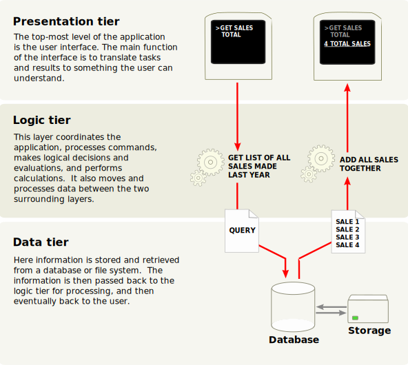

# Capítol 1: Visió general de l'arquitectura

## Aplicació multicapa

Odoo segueix una [arquitectura multicapa](https://en.wikipedia.org/wiki/Multitier_architecture), la qual cosa significa que la presentació, la lògica de negoci i l'emmagatzematge de dades estan separats. Més concretament, utilitza una arquitectura de tres capes (imatge de la Viquipèdia):



La capa de presentació és una combinació d'HTML5, JavaScript i CSS. La capa lògica està escrita exclusivament en Python, mentre que la capa de dades només admet PostgreSQL com a RDBMS (Sistema de Gestió de Bases de Dades Relacionals).

Depenent de l'abast del nostre mòdul, el desenvolupament en Odoo es pot dur a terme en qualsevol d'aquestes capes. Per tant, abans d'avançar, pot ser una bona idea refrescar la memòria si no tenim un nivell intermedi en aquestos temes.

Per a seguir aquest tutorial, necessitarem coneixements molt bàsics d'HTML i un nivell intermedi de Python. Els temes avançats requeriran més coneixements en les altres matèries. Hi ha molts tutorials accessibles gratuïtament, així que no podem recomanar-ne un sobre un altre, ja que depén de la nostra experiència prèvia.

Com a referència, aquest és el [tutorial oficial de Python](https://docs.python.org/3.7/tutorial/).

> **Nota:**
> Des de la versió 15.0, Odoo està fent una transició activa cap a l'ús del seu propi [framework OWL](https://odoo.github.io/owl/), desenvolupat internament, com a part de la seua capa de presentació. El framework JavaScript heretat encara és compatible, però quedarà obsolet amb el temps. Això es tractarà amb més detall en els temes avançats.

## Mòduls d'Odoo

Tant les extensions del servidor com les del client s'empaqueten com a *mòduls* que es carreguen opcionalment en una *base de dades*. Un mòdul és una col·lecció de funcions i dades que tenen un únic propòsit.

Els mòduls d'Odoo poden afegir lògica de negoci completament nova a un sistema Odoo, o bé alterar i ampliar la lògica de negoci existent. Es pot crear un mòdul per a afegir les regles comptables del teu país al suport comptable genèric d'Odoo, mentre que un altre mòdul diferent pot afegir suport per a la visualització en temps real d'una flota d'autobusos.

Tot en Odoo comença i acaba amb els mòduls.

Terminologia: els desenvolupadors agrupen les seues funcionalitats de negoci en *mòduls* d'Odoo. Els mòduls principals orientats a l'usuari es marquen i s'exposen com a *Aplicacions* (*Apps*), però la majoria dels mòduls no són aplicacions. Als *mòduls* també se'ls pot anomenar *addons* (complements), i els directoris on el servidor d'Odoo els troba formen l'``addons_path``.

### Composició d'un mòdul

Un mòdul d'Odoo **pot** contindre una sèrie d'elements:

-   **Objectes de negoci:** Un objecte de negoci (p. ex., una factura) es declara com una classe de Python. Els camps definits en aquestes classes s'assignen automàticament a columnes de la base de dades gràcies a la capa ORM (*Object-Relational Mapping*).
-   **Vistes d'objectes:** Defineixen la visualització de la interfície d'usuari.
-   **Fitxers de dades:** Fitxers XML o CSV que declaren les dades del model:
    -   vistes o informes,
    -   dades de configuració (parametrització de mòduls, regles de seguretat),
    -   dades de demostració,
    -   i molt més.
-   **Controladors web:** Gestionen les peticions dels navegadors web.
-   **Dades web estàtiques:** Imatges, fitxers CSS o JavaScript utilitzats per la interfície web o el lloc web.

Cap d'aquestos elements és obligatori. Alguns mòduls només poden afegir fitxers de dades (p. ex., la configuració comptable específica d'un país), mentre que altres només poden afegir objectes de negoci. Durant aquest curs, crearem objectes de negoci, vistes d'objectes i fitxers de dades.

### Estructura del mòdul

Cada mòdul és un directori dins d'un *directori de mòduls*. Els directoris de mòduls s'especifiquen utilitzant l'opció ``--addons-path`` a la configuració d'Odoo.

Un mòdul d'Odoo es declara mitjançant el seu **manifest**.

Quan un mòdul d'Odoo inclou objectes de negoci (és a dir, fitxers de Python), s'organitzen com un [paquet de Python](https://docs.python.org/3/tutorial/modules.html#packages) amb un fitxer ``__init__.py``. Aquest fitxer conté les instruccions d'importació per a diversos fitxers Python dins del mòdul.

Ací tens un directori de mòdul simplificat:

```bash
module
├── models
│   ├── *.py
│   └── __init__.py
├── data
│   └── *.xml
├── __init__.py
└── __manifest__.py
```

## Edicions d'Odoo

Odoo està disponible en [dues versions](https://www.odoo.com/page/editions): **Odoo Enterprise** (amb llicència i codi font compartit) i **Odoo Community** (codi obert). A més de serveis com el suport o les actualitzacions, la versió Enterprise proporciona funcionalitats extra a Odoo. Des d'un punt de vista tècnic, aquestes funcionalitats són simplement nous mòduls instal·lats per damunt dels mòduls proporcionats per la versió Community.

Comencem? És hora d'escriure la nostra pròpia aplicació!