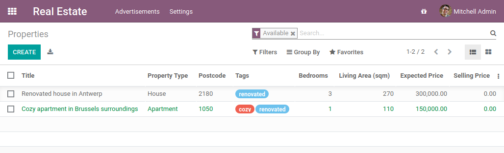
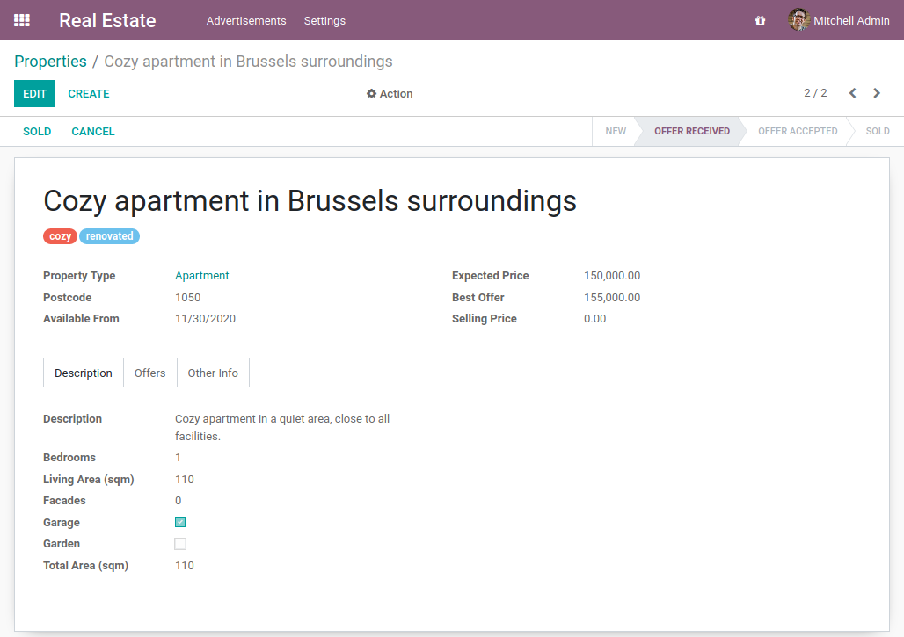
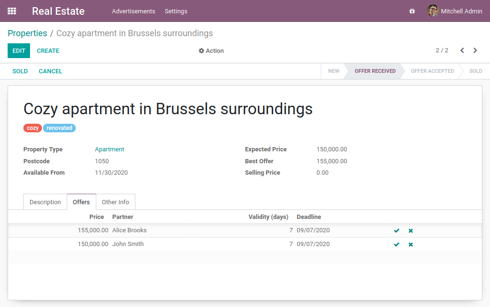
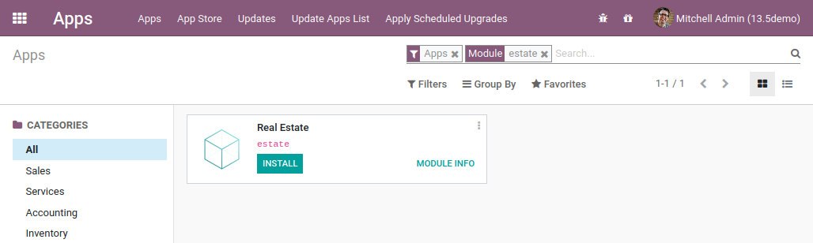

# Capítol 2: Una nova aplicació

El propòsit d'aquest capítol és establir les bases per a la creació d'un mòdul d'Odoo completament nou. Començarem des de zero amb el mínim necessari perquè el nostre mòdul siga reconegut per Odoo. En els capítols següents, anirem afegint funcionalitats progressivament per a construir un cas de negoci real.

## El mòdul d'anuncis immobiliaris

El nostre nou mòdul cobrirà una àrea de negoci molt específica i, per tant, no inclosa en el conjunt estàndard de mòduls: el sector immobiliari (*real estate*). Cal destacar que, abans de desenvolupar un nou mòdul, és una bona pràctica verificar que Odoo no proporcione ja una manera de resoldre el cas de negoci específic.

A continuació es mostra una visió general de la vista de llista principal que conté alguns anuncis:

La part superior de la vista de formulari resumeix la informació important de la propietat, com ara el nom, el tipus de propietat, el codi postal, etc. La primera pestanya conté informació que descriu la propietat: habitacions, superfície habitable, garatge, jardí...

La segona pestanya enumera les ofertes per a la propietat. Ací podem veure que els compradors potencials poden fer ofertes per damunt o per davall del preu de venda esperat. Depén del venedor acceptar o no una oferta.

## Preparar el directori del complement (addon)

!!! abstract "Objectiu"
    L''objectiu d'aquesta secció és que Odoo reconega el nostre nou mòdul, que de moment serà una carcassa buida. Apareixerà llistat a les Aplicacions (*Apps*):

    

El primer pas per a la creació d'un mòdul és crear el directori. Al directori de mòduls que utilitzem, afegirem un nou directori anomenat `estate`.

Un mòdul ha de contindre almenys 2 fitxers: el fitxer `__manifest__.py` i un fitxer `__init__.py`. El fitxer `__init__.py` pot romandre buit de moment i hi tornarem en el capítol següent. D'altra banda, el fitxer `__manifest__.py` ha de descriure el nostre mòdul i no pot estar buit. L'únic camp obligatori és el nom (`name`), però normalment conté molta més informació.

Feu un ull al [fitxer del CRM](https://github.com/odoo/odoo/blob/67a952f30731fc00941587ae165b7a885da0e77e/addons/crm/__manifest__.py) com a exemple. A més de proporcionar la descripció del mòdul (`name`, `category`, `summary`, `website`...), enumera les seues dependències (`depends`). Una dependència significa que el *framework* d'Odoo s'assegurarà que aquests mòduls estiguen instal·lats abans d'instal·lar el nostre mòdul. A més, si es desinstal·la una d'aquestes dependències, el nostre mòdul i **qualsevol altre que en depenga també es desinstal·laran**. Penseu en el gestor de paquets de la vostra distribució de Linux preferida (`apt`, `dnf`, `pacman`...): Odoo funciona de la mateixa manera.

!!! example "Exercici: Crear els fitxers requerits per al mòdul"
 
    Creeu les carpetes i fitxers següents:
    - `/home/$USER/src/tutorials/estate/__init__.py`
    - `/home/$USER/src/tutorials/estate/__manifest__.py`

    El fitxer `__manifest__.py` només hauria de definir el nom i les dependències del nostre mòdul.
    
    L'únic mòdul base del *framework* necessari ara mateix és `base`.

Reinicieu el servidor d'Odoo i vés a Aplicacions (*Apps*). Feu clic a **Actualitzar la llista d'aplicacions** (*Update Apps List*), busqueu `estate` i... apareix el nostre mòdul! No ha aparegut? Potser podeu provar de llevar el filtre predeterminat d''Apps' :wink:

!!! warning "Avís"
    Recordeu activar el **mode desenvolupador** (*developer-mode*) tal com s'explica en el capítol anterior. Si no ho feu, no vureu el botó **Actualitzar la llista d'aplicacions**.

!!! example "Exercici: Convertiu el mòdul en una 'App'"
    Afegiu la clau adequada al vostre `__manifest__.py` perquè el mòdul aparega quan el filtre d''Apps' estiga activat.

Fins i tot podeu instal·lar el mòdul! Però, òbviament, és una carcassa buida, així que no apareixerà cap menú.

Tot bé? Si és així, doncs anem a [crear el nostre primer model](../03_modelboooooosic/)!